# Creating a VPC
1. Navigate to AWS Management Console
2. Select VPC from lists of services
3. Select 'Your VPCs' from navigation panel on the left.
4. Click 'Create VPC'. Give a name, and IP address (x.x.0.0/16).  
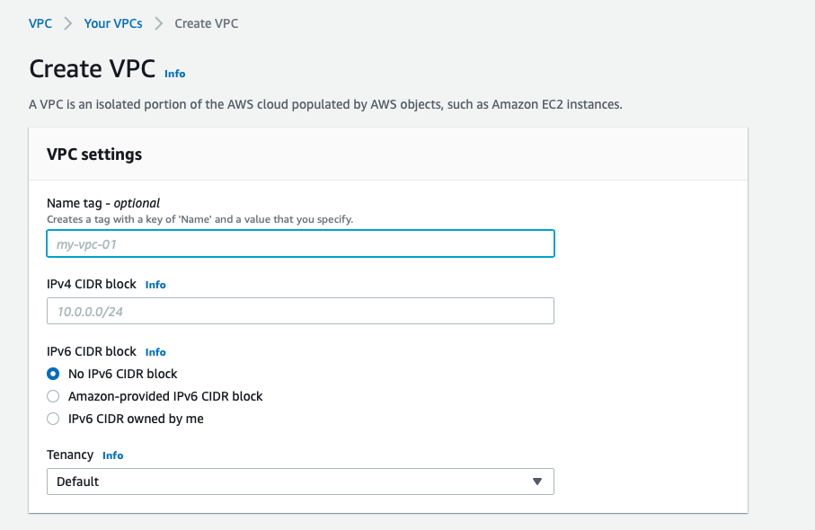
5. Select 'Subnets' and click 'Create Subnet'. Select your VPC and add a public and private subnet. Assign a 'IPv4 CIDR block' for each subnet (x.x.1.0/24 and x.x.2.0/24)   
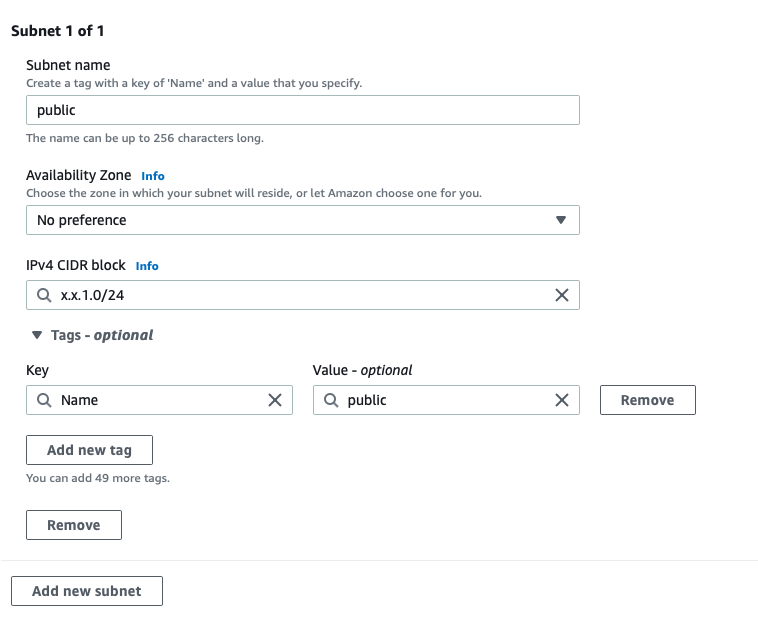
6. Select 'Internet Gateway' and click 'Create Internet Gateway'. Give a name and click 'create'
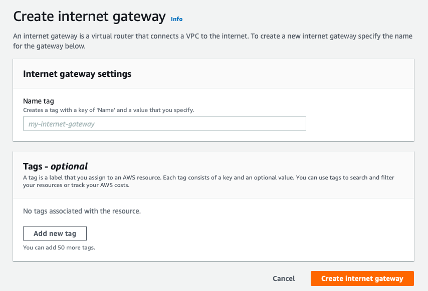
7. Select 'Network ACL' and click 'Create Network ACL'. Give a name i.e nacl-public and select your VPC. Create another NACL for private.
8. Assign 'Inbound Rules' and 'Outbound Rules' for the private and public NACLs.
**Public**    
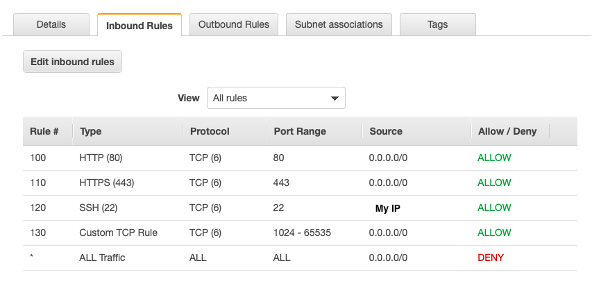   
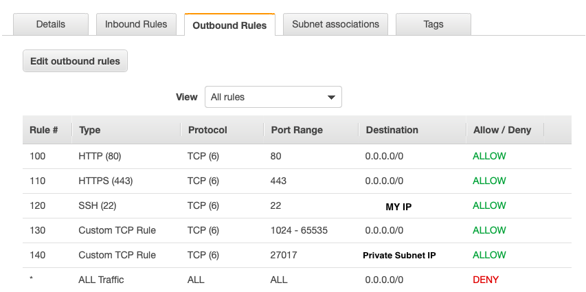    
**Private**
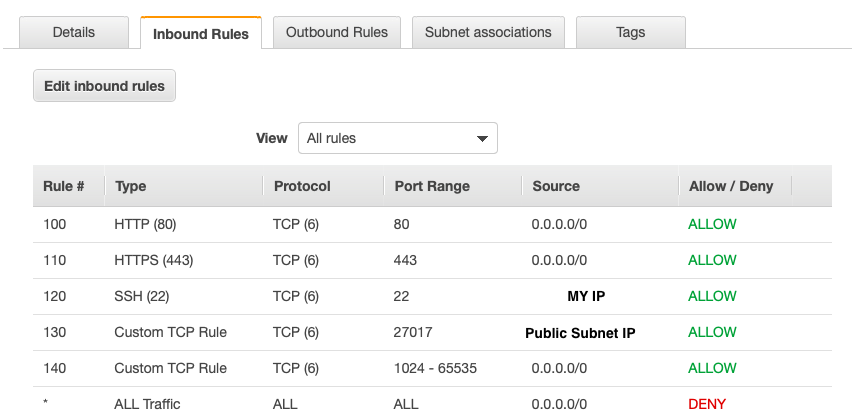   
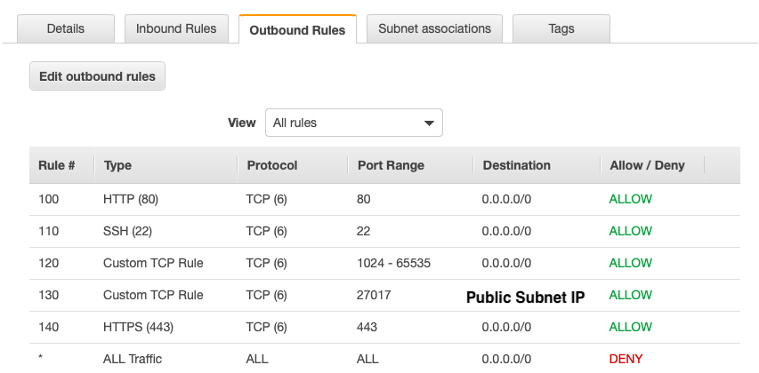    
9. Click the 'Subnet associations' tab and associate with the corresponding subnet i.e private NACL --> private subnet.
10. Select 'Route Tables' and click 'Create route table'. Assign a name i.e public-route and select your VPC. Click 'create'. Repeat for private
11. Navigate to the newly created route tables and click the 'Routes' tab. Click 'Edit routes'. Configure as shown:
**Public**
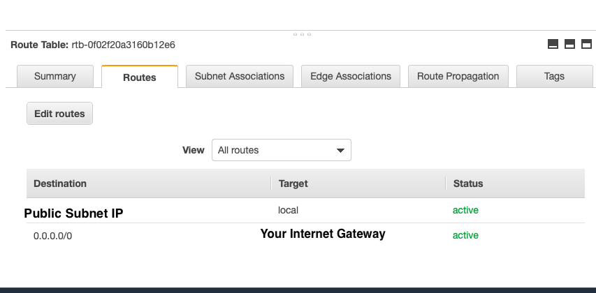     

**Private**
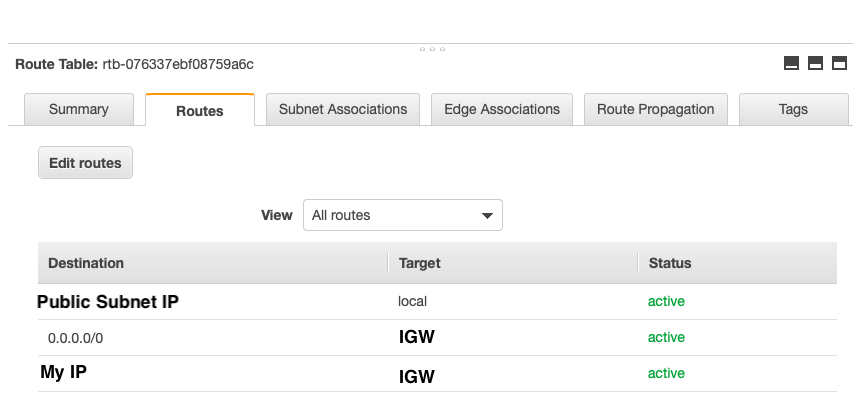
12. Click the 'Subnet associations' tab and associate with the corresponding subnet i.e private NACL --> private subnet.
13. Navigate to EC2 and create an instance for the **app**. Follow steps 1 and 2 as normal.
14. For Step 3: Configure Instance Details, amend the 'Network' to your newly created VPC. Select your public subnet. Then set 'Auto-assign Public IP' to enable.
15. Continue as normal until Step 6: Configure Security Group. Configure the Security Group as follows:
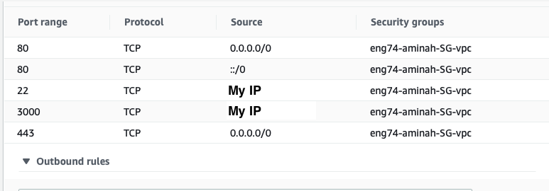
16. Repeat for the database instance. For Step 3 of instance creation, select your new VPC, but then select the **private** subnet. Continue and then configure the security group as follows:
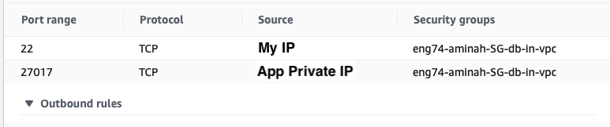
17. Connect to the instances.
18. Copy the app files using
```bash
scp -i ~/.ssh/key.pem -r folder ubuntu@ip:~/
```
19. Run the provisioning files. Ensure sufficient permissions have been applied i.e. ```chmod +x file```
20. To view the posts page, stop the app and use the following command:
```bash
DB_HOST=db_ip pm2 start app.js
```
